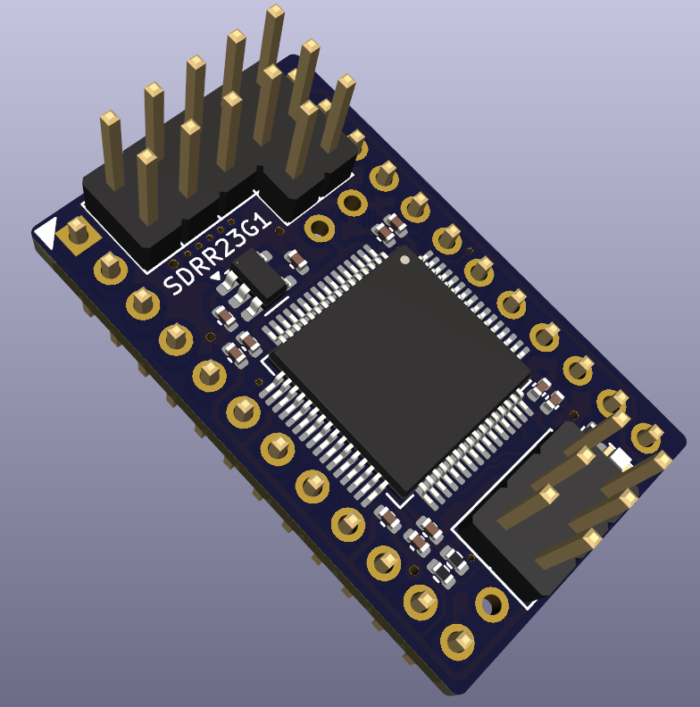

# Software Defined Retro ROM (SDRR)

A highly configurable and low-cost ROM replacement solution for vintage computers.  Replace failed ROMs in Commodore 64s, VIC-20s, PETs, and other retro systems with a $2 microcontroller.

Emulates 2364, 2332 and 2316 ROMs using the STM32F4 family of microcontrollers.  Replaces kernel, BASIC, character set, diagnostic, and application ROMs.

## Key Features

💰 Based on **[$2 microcontroller](docs/STM32-SELECTION.md)**.

⚡ **[Fast](docs/STM32-SELECTION.md)** enough for PETs, VIC-20s, C64s, 1541s, IEEE drives, etc. Support faster systems with higher end microcontroller.

📐 **[Same footprint](docs/images/sdrr-24-pin-side.png)** as original ROMs - doesn't overhang the socket like other solutions.

🚀 **[Quick programming](docs/PROGRAMMING.md)** - just connect 4 wires and `make run`. No programming jigs necessary.

🔌 **[Use a $5 programmer](docs/PI-PICO-PROGRAMMER.md)** - no expensive EEPROM programmer required.

🛠️ **[Reflash in situ](docs/PROGRAMMING.md)** - no need to remove the ROM from the host when reprogramming.

⚙️ **[Software configurable](docs/CONFIGURATION.md)** chip select lines - no hardware jumpers required.

💾 Stores up to **[16 ROM images](docs/STM32-SELECTION.md)** of different sizes and chip select configurations.  Image selectable via jumpers.

📦 **[Replace multiple ROMs with one ROM](docs/MULTI-ROM-SETS.md)** one SDRR can replace up to 3 original ROMs e.g. all of C64 kernel, BASIC, character set.

🔀 **[Dynamic bank switching](docs/MULTI-ROM-SETS.md)** - switch between ROM images on the fly, e.g. different char ROMs.

💻 **[Hackable at runtime](docs/RUNTIME-ACCESS.md)** - change the ROM images being served and access telemetry from the ROM at runtime using **[Airfrog](https://piers.rocks/u/airfrog)** or other SWD probes.

🧩 **[Images combined automatically](docs/CONFIGURATION.md)** - no need to manually build up your own larger PROM image containing multiple retro ROMs.

🏭 **[Two layer PCB](sdrr-pcb/README.md)**, component on single-side, limited BOM for low manufacturing cost/complexity.

🎯 Supports multiple **[STM32F4xxR](docs/STM32-SELECTION.md)** variants: F401, F411, F405, F446 (others can be added).

🔓 **[Open source](LICENSE.md)** software and hardware.

## Introduction

The video below provides an introduction to the Software Defined Retro ROM:

[](https://youtu.be/Jhe4LF5LrZ8)

## Hardware

This is the STM32F4 24-pin version, hardware revison G1.  See [sdrr-pcb](sdrr-pcb/README.md) for the hardware designs and documentation.

<div style="display: flex; justify-content: center; gap: 20px;">
  <a href="docs/images/sdrr-24-pin-side.png">
    
  </a>
</div>

## Quick Start

You have two options

- [use the pre-built binaries](#pre-built-binaries)
- [build the firmware yourself.](#build-yourself)

### Pre-built Binaries

Use [Airfrog](https://piers.rocks/u/airfrog) or your favourite STM32 programmer to flash the pre-built binaries from the project's [releases](https://github.com/piersfinlayson/software-defined-retro-rom/releases/) page.  Scroll down to the "Assets" section of the latest release, and download the `bin-*.zip` or `elf-*.zip` file for your STM32 variant.  These zip files contain pre-built binaries for the various SDRR image collections, including the C64, VIC-20, PET, and 1541 disk drive.

### Build Yourself

Once you have the project cloned, and the required [dependencies](INSTALL.md) installed, you can build and flash an SDRR image using the following commands - replace `f411re` with your [target STM32 variant](#supported-stm32-microcontrollers), and [`config/c64.mk`](/config/c64.mk) with the [configuration](config/README.md#available-configurations) you want to use.

```bash
# C64
STM=f411re CONFIG=config/c64.mk make run
```

```bash
# VIC-20 (PAL)
STM=f411re CONFIG=config/vic20-pal.mk make run
```

```bash
# PET 40 column 50Hz
STM=f411re CONFIG=config/pet-4-40-50.mk make run
```

This will download the desired ROM images automatically, generate the required firmware, and flash it to the SDRR device.

### After Flashing

Set the [SDRR jumpers](docs/IMAGE-SELECTION.md) to select the desired ROM image (see the [config file](/config/), or logs from your SDRR device, for which # corresponds to which image) and you're now ready to install the SDRR device in your retro system.

For configuration options, see [Configuration](docs/CONFIGURATION.md) and the [Makefile](Makefile).

## Documentation

| Topic | Description |
|-------|-------------|
| [Frequently Asked Questions](docs/FAQ.md) | Answers to common questions about SDRR. |
| [Installation](INSTALL.md) | Installation of dependencies. |
| [Programming](docs/PROGRAMMING.md) | How to program the SDRR device. |
| [Available Configurations](config/README.md#available-configurations) | Various pre-collated ROM collection configurations. |
| [STM32 Selection](docs/STM32-SELECTION.md) | How to select the appropriate STM32 variant for your application. |
| [Image Selection](docs/IMAGE-SELECTION.md) | How to tell SDRR which of the installed ROM images to serve. |
| [Image Sets](docs/MULTI-ROM-SETS.md) | How to use a single SDRR to support multiple ROMs simultaneously or to dynamically switch between images. |
| [Configuration](docs/CONFIGURATION.md) | SDRR configuration options. |
| [Runtime Access/Control](docs/RUNTIME-ACCESS.md) | Access and control the SDRR while it is serving ROMs. |
| [Compatibility](docs/COMPATIBILITY.md) | Compatibility with various retro systems. |
| [Logging](docs/LOGGING.md) | How to enable and use logging in SDRR. |
| [Technical Summary](docs/TECHNICAL-SUMMARY.md) | Overview of the SDRR architecture, operation and design decisions. |
| [Technical Details](docs/TECHNICAL-DETAILS.md) | Technical details of the SDRR firmware and hardware. |
| [Custom Hardware](docs/CUSTOM-HARDWARE.md) | Guide on designing custom hardware for SDRR. |
| [Build System](docs/BUILD-SYSTEM.md) | How the SDRR build system works. |
| [Voltage Levels](docs/VOLTAGE-LEVELS.md) | How the SDRR supports the required logic voltage levels. |
| [Pi Pico Programmer](docs/PI-PICO-PROGRAMMER.md) | How to use a $5 Raspberry Pi Pico as a programmer for SDRR. |
| [Manufacturing Test](docs/MANUFACTURING-TEST.md) | Information on testing SDRR during manufacturing. |
| [STM32 Clones](docs/STM32-CLONES.md) | Information using STM32 clones with SDRR. |
| [Future Enhancements](docs/FUTURE-ENHANCEMENTS.md) | Possible future enhancements under consideration. |
| [License](LICENSE.md) | SDRR software and hardware licenses. |

## Debugging

The best place to start with debugging is [`Logging`](docs/LOGGING.md).  This will help you see what the SDRR is doing, and why it may not be working as expected.

If you have an [Airfrog](https://piers.rocks/u/airfrog), you can use it to inspect the SDRR firmware and its current state.

If you'd like a hand, raise an issue on the [GitHub issues page](https://github.com/piersfinlayson/software-defined-retro-rom/issues).  Please provide:

- your build configuration
- the output from `make info-detail`
- any logging from the SDRR device
- the STM32 variant you are using and the PCB type/revision
- the retro system you are trying to SDRR with.

## License

See [LICENSE](LICENSE.md) for software and hardware licensing information.
