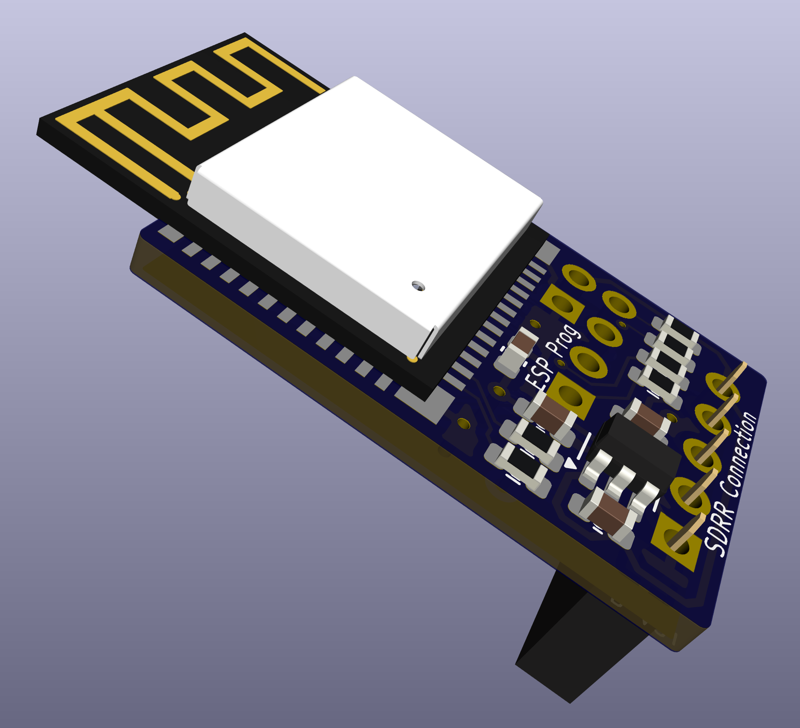

# ESP32 WiFi Programmer Revision A

**Unverified** - this revision has not yet been tested or confirmed to work.  Order PCBs at your own risk.

This PCB is designed to be used as a daughtboard for the (24 or 28 pin) SDRR to program is via WiFi (and/or possibly via WiFi).  It is currently in the prototyping stage.

  

## Contents

- [Schematic](wifi-prog-rev-a-schematic.pdf)
- [Fab Notes](sdrr-28-pin-rev-a-fab-notes.pdf)
- [Gerbers](gerbers/) - unverified
- [Ordering Bare PCBs](#ordering-bare-pcbs)
- [Errata](#errata)
- [Notes](#notes)
- [Changelog](#changelog)
- [BOM](#bom)

## Ordering Bare PCBs

## Errata

None

## Notes

None

## Changelog

First revision.

## BOM

| Reference | Component Type | Value | Package | Quantity | Notes |
|-----------|----------------|-------|---------|----------|-------|
| C1, C2 | Capacitor | 1uF | 0603 | 2 | |
| C3 | Capacitor | 10uF| 0603 | 1 | |
| C4 | Capacitor | 100nF | 0603 | 1 | |
| R1, R2, R3, R4 | Resistor | 4k7 | 0603 | 4 | |
| R5, R6 | Resistor | 100R | 0603 | 2 | |
| U1 | ESP32-C3-MINI-1 | - | - | 1 | |
| U2 | AP2112K-3.3 | - | SOT-23-5 | 1 | |
| J1 | Pin socket | 1x5 | Female | 1 | 2.54mm (0.1") pin pitch |
| J2 | None | DNP | | 1 | Do not populate |
| J3 | None | DNP | | 1 | Do not populate |
